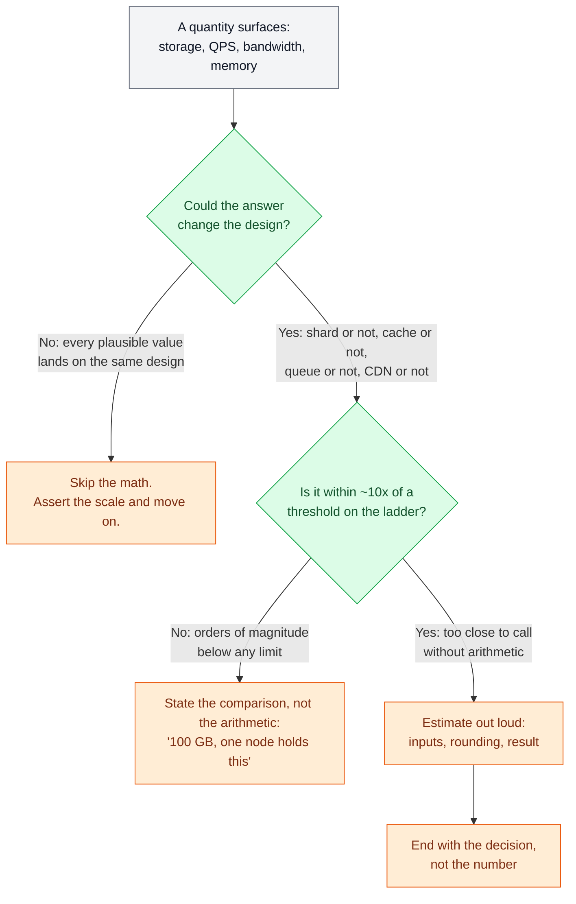
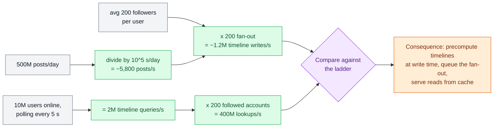

# 🧮 Estimation & the Numbers

> **Prerequisites:** [Latency, Throughput & Percentiles](/synapse/system-design-from-first-principles/foundations/latency-throughput-percentiles) | **You'll be able to:** decide *when* an estimate is worth doing — only when the result changes a design decision; carry the working ladder of latencies, per-node throughputs, and storage ceilings; run a sixty-second order-of-magnitude estimate out loud, from stated inputs to a design consequence.

---

## 🧨 The problem (why this exists)

Watch two candidates fail the same interview in opposite directions.

**The first opens with ten minutes of arithmetic:**

users, requests per user, bytes per request, storage per year, bandwidth, growth — all computed to three significant figures. Then the design begins, and not one of those numbers is ever consulted again. The math was a ritual, not an instrument.

**The second skips the math entirely and pays for it.**

Handed a Yelp-like problem — 10 million businesses at roughly a kilobyte each — they announce a sharding strategy. That dataset is about 10 GB; even 10×'d to hold reviews it is ~100 GB, a size a single modern database node holds without noticing. This is exactly the most common estimation failure: candidates carrying constraints from 2015-era study material into a world where single nodes hold tens of terabytes. Hardware moved an order of magnitude; the intuition didn't.

**Both failures share a root cause: no working connection between arithmetic and architecture.**

And that connection is what real designs turn on. DDIA's social-network case study hinges on one multiplication: serving home timelines by querying at read time costs about **400 million lookups per second**, while precomputing timelines at write time costs **just over 1 million writes per second** <abbr title="[p. 35–36]">[i]</abbr>. Same product, same users — a 400× gap between two architectures, visible only if you run the numbers. The multiplication *is* the design decision.

> This lesson teaches estimation the way strong candidates practice it: rarely, quickly, and always in service of a decision.

---

## 🧠 Intuition first

**Back-of-envelope estimation is not accounting.**

- The number you produce is disposable; the decision it buys is the deliverable.
- Nobody cares whether your feed generates 470 GB or 520 GB a day. They care whether that's a *"one Postgres node"* problem or a *"shard it from day one"* problem, and 470 vs. 520 never flips that answer.
- Being wrong by 20% is free. Being wrong by 10× ships the wrong system.

**That reframing gives you this book's core stance on estimation: estimate only when the result could change the design**

- — the common mistakes are almost all failures to run *decision-relevant* math, and the advice before sharding is simple: slow down, do the math.
- Every estimate is secretly a comparison: a quantity you compute versus a threshold you carry — what one cache node holds, what one database sustains, what one NIC pushes.
- If the comparison is lopsided by two orders of magnitude, don't perform arithmetic; assert it (*"100 GB — one node holds this"*) and keep designing.
- If it's within about 10× of a threshold — genuinely too close to call — that's when you slow down and compute, out loud.

Two habits make the computing part fast:

- **Round violently, protect the exponent.** 86,400 seconds per day becomes 10^5. 500 million becomes 5 × 10^8. Multiplication and division become adding and subtracting exponents. You will be off by 20–50% and it will never matter, because thresholds on the ladder are themselves order-of-magnitude creatures.
- **Collapse powers of 2 into powers of 10.** 2^10 = 1,024 ≈ 10^3, so KiB/MiB/GiB/TiB behave like thousand/million/billion/trillion bytes for envelope purposes. Reserve the distinction for the rare case it matters (it almost never does at whiteboard resolution).

<div style="border-left:4px solid #195045;background:rgba(25,80,69,0.08);padding:0.6rem 1rem;border-radius:0 0.5rem 0.5rem 0;margin:1.25rem 0">

💡 **An estimate ends in a verb.** The deliverable is a sentence shaped like *"~400 GB — fits comfortably in one cache node, so we don't shard."* If your estimate ends with a number instead of a decision, it wasn't worth the airtime.

</div>

---

## ⚙️ How it works

### 🔁 The method: four moves

Strong estimation is a tight loop you can run in under a minute:

1. **Name the decision first.** *"Whether this fits one database node."* *"Whether the write path needs a queue."* If you can't name a decision, you've just discovered you don't need the estimate.
2. **Fix the inputs, out loud.** Use what the interviewer gave you; state assumptions for the rest (*"call it a kilobyte per post — text plus metadata"*). Saying assumptions aloud invites correction *now*, when it's cheap.
3. **Compute in powers of ten, one line at a time.** Keep units visible at every step — most estimation disasters are silent unit errors (bits vs. bytes, per-day vs. per-second), not wrong multiplication.
4. **Compare against the ladder and state the consequence.** The final sentence names the design move the number just bought.

The decision of whether to estimate at all is itself a tiny flowchart:



### 🪜 The ladder

The comparison step only works if you carry thresholds in your head — a *ladder* of anchor values you can climb without looking anything up. It has three families of rungs.

- ⏱️ **Time rungs** — how long things take, from the [latency and percentile machinery](/synapse/system-design-from-first-principles/foundations/latency-throughput-percentiles) you already have. In-memory cache reads come back in under a millisecond; a network hop within a region costs about 1–2 ms; a cached database read runs 1–5 ms, an uncached disk-backed read 5–30 ms, and a simple indexed row lookup on SSD-backed storage is on the order of 10 ms; crossing regions costs 50–150 ms. Then the tail: DDIA reports cross-region round trips of **up to several minutes** at high percentiles and intra-datacenter packet delays exceeding a minute during network reconfigurations <abbr title="[p. 350]">[i]</abbr> — the ladder's reminder that averages are the top of the distribution, not the whole of it.
- 🚀 **Rate rungs** — what one node of each type sustains: an in-memory cache node serves 100k+ operations/second; a single well-tuned relational database sustains tens of thousands of transactions per second — up to ~50k reads, 10–20k writes, and 20k+ per second for *simple* inserts on Postgres; a modern log broker moves up to ~1M messages/second; an application server holds 100k+ concurrent connections and pushes up to ~25 Gbps.
- 📦 **Size rungs** — what fits where: a big cache node holds up to ~1 TB in memory; a single database node handles up to ~64 TiB (managed engines like Aurora stretch to 128 TiB, and 256 TiB on current versions); a broker retains tens of TB; object storage is effectively unbounded. 2025 cloud ceilings run to multi-TB RAM machines and tens of TB of local NVMe per instance — treat the specific instance names as perishable, but the order of magnitude as the point.

**Under the rungs sit the constants** — pure arithmetic, no source needed: ~86,400 seconds/day ≈ 10^5; ~2.6M seconds/month; ~3 × 10^7 seconds/year; 1 ASCII character = 1 byte; an int64 or pointer = 8 bytes; a UUID stored as text = 36 bytes.

The compact table version of all of this lives below in *Numbers that matter*. Now, the method applied — three estimates worked end to end, each closing with the design move it buys.

### ✍️ Worked estimate 1 — the feed write path (QPS)

*Decision at stake: can timelines be computed at read time, or must they be precomputed — and does precomputing need a queue?*

Inputs, from DDIA's case study: 500M posts/day, average 200 followers per user, 10M users online polling every 5 seconds <abbr title="[p. 34–35]">[i]</abbr>.

- Write rate: 5 × 10^8 posts/day ÷ ~10^5 s/day ≈ **5,800 posts/s** average, spiking to **150,000 posts/s** <abbr title="[p. 34]">[i]</abbr>.
- Read-time approach: 10M online users ÷ 5 s = **2M timeline queries/s**; each checks ~200 followed accounts → **400M lookups/s** <abbr title="[p. 35]">[i]</abbr>.
- Write-time approach: 5,800 posts/s × 200 followers ≈ **1.2M timeline writes/s** (*"just over 1 million"* in DDIA's words) <abbr title="[p. 36]">[i]</abbr>.



**Consequence.**

400M lookups/s is unbuildable at sane cost — hundreds of times beyond what any reasonable fleet of database nodes serves. 1.2M writes/s is large but tractable, spread across cache shards. So the architecture flips to fan-out-on-write: precompute each timeline as a materialized view and serve reads from cache <abbr title="[p. 35–36]">[i]</abbr>.

The peak then seals a second decision. At spike, 150k posts/s × 200 = **30M timeline deliveries/s** — and you do not provision steady-state infrastructure for that. You put a queue in front of fan-out and let delivery lag a few seconds during bursts, exactly as DDIA prescribes <abbr title="[p. 36]">[i]</abbr>. One multiplication chose the architecture; one more chose the queue.

### 💾 Worked estimate 2 — feed storage

*Decision at stake: does the posts table shard, and when?*

Inputs: the same 500M posts/day <abbr title="[p. 34]">[i]</abbr>; assume ~1 KB per post — text plus metadata, media stored separately in object storage (assumption, stated in the room).

- 5 × 10^8 posts/day × 10^3 bytes ≈ **500 GB/day** of new post data.
- Per year: 500 GB × 365 ≈ **~180 TB/year**.
- Single-node ceiling: ~64 TiB ≈ 7 × 10^4 GB → 7 × 10^4 ÷ 500 ≈ **~140 days**.

**Consequence.**

- The posts store blows through a single node's ceiling in under five months — here sharding is not a reflex, it's arithmetic, so you design the partitioning scheme up front.
- Contrast deliberately with the Yelp case from earlier: 10M businesses × ~1 KB ≈ 10 GB, roughly 100 GB with reviews — three orders of magnitude below the same ceiling, so it never shards.
- Identical question, opposite answers, and only the envelope tells you which side you're on.

### 📺 Worked estimate 3 — video egress (bandwidth)

*Decision at stake: can a video service serve viewers from origin servers, or is a CDN structural?*

Inputs: 1M concurrent viewers. `Rule of thumb, not from source:` a 1080p stream runs on the order of ~5 Mbps — state it as an assumption and let the interviewer adjust.

- Egress: 10^6 viewers × 5 × 10^6 bits/s = 5 × 10^12 bits/s = **5 Tbps**.
- Per-server NIC: ~25 Gbps → 5,000 ÷ 25 = **200 servers saturated doing nothing but pushing bytes**.
- Cross-region links: typically 100 Mbps–1 Gbps — three to four orders of magnitude short of serving distant regions from one origin.

**Consequence.**

Egress dominates the design. You do not serve 5 Tbps from an origin fleet across regions; you terminate it at the edge — a CDN carries the steady-state load and the origin serves only cache fills. Note what the estimate did *not* need: viewer counts to three digits, or the exact bitrate. Any plausible bitrate between 2 and 10 Mbps lands on the same architecture. The estimate was worth doing because *"CDN or not"* was a real fork; its precision didn't matter because every input in range picks the same branch.

---

## ⚖️ Trade-offs

Estimation itself is a resource-allocation decision — whiteboard minutes and attention are the budget. The same [trade-off discipline](/synapse/system-design-from-first-principles/foundations/thinking-in-tradeoffs) that governs your architecture governs when you reach for the envelope:

| Option | Gives you | Costs you | Use when |
| --- | --- | --- | --- |
| Assert from the ladder, no arithmetic | Speed; signals calibrated experience | Wrong call if the case was closer than it looked | The quantity is ≥100× from any threshold ("100 GB — one node") |
| Sixty-second envelope at the decision point | A defended, quantified design choice | A minute of airtime; needs practiced mental math | The design genuinely forks and the value is within ~10× of a threshold |
| Full upfront volumetrics pass | A complete numeric picture early | 5–10 minutes producing numbers with no consumer; reads as ritual | The interviewer explicitly asks, or you're writing a real capacity plan |
| Defer with a named trigger ("if writes exceed ~10k TPS, we shard") | Momentum; the threshold is on record | You must actually revisit it when the design firms up | Inputs are genuinely unknowable mid-interview |

The middle two rows are where candidates most often pick wrong: defaulting to the full upfront pass because it feels rigorous. It isn't rigor — it's deferred thinking. The envelope-at-the-decision-point row is what senior interviewers listen for, because it's how the math is actually used on the job.

---

## 🔢 Numbers that matter

The working table — every figure carries its source: a DDIA page cite or an explicit flag. (A bare-tables quick reference, kept current, lands in this book's Reference module later.)

```d2
classes: {
    header: {
      shape: rectangle
      style.bold: true
      style.fill: "#1A1A2E"
      style.font-color: "#FFFFFF"
      style.stroke: "#0D32B2"
      style.stroke-width: 2
    }

    row_header: {
      shape: rectangle
      style.bold: true
      style.fill: "#E8EEFF"
      style.font-color: "#111827"
      style.stroke: "#0D32B2"
      style.stroke-width: 2
    }

    mdcell: {
      shape: rectangle
      width: 260
      style.fill: "#E8EEFF"
      style.font-color: "#111827"
      style.stroke: "#0D32B2"
      style.stroke-width: 2
    }
  }

System Design Scaling Reference: {
  style.bold: true
  style.font-size: 20
  near: top-center
  grid-rows: 6
  grid-columns: 6
  horizontal-gap: 0
  vertical-gap: 0


  h1: "↓ Components \\ Metrics →" {class: header}
  h2: "Latency" {class: header}
  h3: "Throughput" {class: header}
  h4: "Storage/Capacity" {class: header}
  h5: "Compute" {class: header}
  h6: "Scale Triggers" {class: header}

  r1c1: "Caching" {class: row_header}

  r1c2: |md
  - **< 1ms same-region cache read**
  - **\> 1ms triggers scale**
  | {class: mdcell}

  r1c3: |md
  - **100k+ ops/second**
  | {class: mdcell}

  r1c4: |md
  - **Memory-bound, up to ~1TB per node**
  | {class: mdcell}

  r1c5: |md
  - **Bounded by node vCPU/RAM allocation**
  - **Typically 2-16 cores per cache instance**
  | {class: mdcell}

  r1c6: |md
  - **Hit rate < 80%**
  - **Latency > 1ms**
  - **Memory usage > 80%**
  - **Cache churn/thrashing**
  | {class: mdcell}


  r2c1: "Databases" {class: row_header}

  r2c2: |md
  - **Cached: 1-5 ms**
  - **Uncached disk: 5-30 ms**
  - **Indexed SSD: ~10ms**
  | {class: mdcell}

  r2c3: |md
  - **~50k read TPS**
  - **10-20k write TPS**
  - **Postgres: 20k+/s inserts**
  | {class: mdcell}

  r2c4: |md
  - **~64 TiB/node**
  - **Aurora: 128-256 TiB**
  - **5-20k connections**
  | {class: mdcell}

  r2c5: |md
  - **8-64 cores typical**
  - **Scales with storage-engine and query load**
  | {class: mdcell}

  r2c6: |md
  - **Write TPS > 10k**
  - **Read latency > 5ms uncached**
  - **Geographic distribution needs**
  | {class: mdcell}


  r3c1: "App Servers" {class: row_header}

  r3c2: |md
  - **Response latency > SLA triggers scale**
  - **Intra-region hop: 1-2ms**
  | {class: mdcell}

  r3c3: |md
  - **100k+ concurrent connections**
  - **Up to ~25 Gbps**
  | {class: mdcell}

  r3c4: |md
  - **64-512GB RAM standard**
  - **Up to 2TB**
  | {class: mdcell}

  r3c5: |md
  - **8-64 cores @ 2-4 GHz**
  | {class: mdcell}

  r3c6: |md
  - **CPU > 70%**
  - **Latency > SLA**
  - **Connections near 100k/instance**
  - **Memory > 80%**
  | {class: mdcell}


  r4c1: "Message Queues" {class: row_header}

  r4c2: |md
  - **1-5ms end-to-end**
  | {class: mdcell}

  r4c3: |md
  - **Up to ~1M msgs/sec per broker**
  | {class: mdcell}

  r4c4: |md
  - **Up to ~50TB retained per broker**
  | {class: mdcell}

  r4c5: |md
  - **Partition count ~200k per cluster**
  | {class: mdcell}

  r4c6: |md
  - **Throughput near 800k/s**
  - **Partitions ~200k/cluster**
  - **Growing consumer lag**
  | {class: mdcell}


  r5c1: "General Constants" {class: row_header}

  r5c2: |md
  - **Cross-region RTT: 50-150ms**
  - **Tail latency: up to minutes**
  - **GC pauses: few ms**
  - **Historical GC pauses: minutes**
  - **Clock drift: ~6ms/30s (~17s/day)**
  - **NTP error: ~35ms; spikes ~1s**
  | {class: mdcell}

  r5c3: |md
  - **Intra-DC: ~10-20 Gbps**
  - **Cross-region: 100Mbps-1Gbps**
  - **Fan-out: 500M posts/day**
  - **Average: 5.8k/s; peak: 150k/s**
  - **×200 fan-out: ~1.2M writes/s**
  | {class: mdcell}

  r5c4: |md
  - **Seconds/day/month/year: ~86.4k / ~2.6M / ~3×10^7**
  - **Powers bridge: 2^10 = 1,024 ≈ 10^3**
  - **KiB ≈ KB**
  - **char: 1B**
  - **int64/pointer: 8B**
  - **UUID text: 36B**
  | {class: mdcell}

  r5c5: |md
  - **GC pauses affect compute scheduling**
  - **Clock drift and NTP affect node timekeeping**
  | {class: mdcell}

  r5c6: |md
  - **HDD failure: 2-5%/year**
  - **10k-disk fleet: ~1 disk lost/day**
  - **SSD failure: 0.5-1%/year**
  - **Uncorrectable SSD errors: ~1/drive/year**
  | {class: mdcell}
}
```

---

## 🏭 In production

**Estimation does not stop once a design is approved — it changes job.**

Think of planning fuel for a long drive. Before setting off you estimate from distance and typical consumption. Once moving, you stop estimating and read the gauge. The estimate was never meant to be accurate. It was meant to tell you whether to set off at all, and whether to plan a stop.

Production systems run the same three phases.

- **Before launch**, estimates size the first deployment — how many application servers, how large a database, whether a CDN is structural rather than optional.
- **After launch**, measurements replace them. Real percentiles, real cardinality and real growth rates are cheaper and far more truthful than any arithmetic.
- **Afterwards**, estimates return for the questions measurement cannot answer: what breaks at ten times today's load, what next quarter's bill looks like, whether November's known spike fits.

**Headroom is where estimation meets queueing theory.** Latency climbs gently as utilisation rises, then explodes as a system approaches capacity <abbr title="(p. 37)">[i]</abbr>. So teams size for a target utilisation well below the measured ceiling — often around half of it, so that losing one of two availability zones doubles per-node load without crossing the knee. `Rule of thumb, not from source:` the exact target varies by organisation and by how fast the system can scale out.

**Re-plan by order of magnitude, not by percentage.** The useful cadence is to design for roughly ten times current load and revisit the architecture on arrival <abbr title="(p. 52)">[i]</abbr>. The reason is that architectures fail in jumps, not gradients: a shape that serves 10k QPS usually also serves 30k, and usually does not serve 300k.

<div style="border-left:4px solid #195045;background:rgba(25,80,69,0.08);padding:0.6rem 1rem;border-radius:0 0.5rem 0.5rem 0;margin:1.25rem 0">

💡 **Memorise ratios and methods, not constants.** Every hardware ceiling on this page is perishable. Amazon Aurora's cluster volume, for instance, doubled from 128 TiB to 256 TiB during 2025 <abbr title="[web: AWS Aurora quotas and constraints]">[i]</abbr>. The *method* — compare the estimate against a ladder, then let the comparison decide — survives every such change. The specific rung does not.

</div>

---

## 🪤 Pitfalls & interview traps

<div style="border-left:4px solid #da5233;background:rgba(218,82,51,0.08);padding:0.6rem 1rem;border-radius:0 0.5rem 0.5rem 0;margin:1.25rem 0">

⚠️ **False precision is the classic tell.** Carrying three significant figures through a calculation whose inputs are guesses to within a factor of two signals that you have mistaken arithmetic for evidence. Round hard, round early, and say which inputs are assumptions. An answer of *"a few hundred gigabytes, so one node"* is stronger than *"412.7 GB"* — because it is honest about what the number can bear.

</div>

The remaining traps are cheaper individually, and they recur constantly.

- **Bits versus bytes.** Network figures are quoted in bits per second, storage in bytes. A 5 Mbps stream is 0.625 MB/s, and mixing the two puts you off by 8× — enough to change the design and not enough to look obviously wrong.
- **Powers of ten versus powers of two.** A vendor's "256 TB" and its "256 TiB" differ by about 10%; at petabyte scale that gap is real hardware. Aurora's ceiling is quoted in TiB, which is why this lesson writes it that way.
- **Costing only the raw rows.** Row size × row count is the *floor*, not the answer. Replication factor, secondary indexes, and write-ahead and compaction overhead routinely multiply it several times over.
- **Averaging away the peak.** A system provisioned for the mean fails at the spike, and spikes are where the interesting engineering lives — the fan-out exercise above turns on exactly this.
- **Estimating something that decides nothing.** The point of an estimate is to change a decision. If the answer is the same at 100 GB and 10 TB, the arithmetic was ceremony — see [The Interview at 10,000 Feet](/synapse/system-design-from-first-principles/foundations/the-interview-at-10000-feet) on capacity-math theatre.

---

## ✅ Check yourself

```quiz
{"prompt": "A service has 100M DAU, each triggering ~10 reads/day. Using ~10^5 seconds/day, what is the average read QPS, and what does it imply?", "options": ["~1,000 QPS, which a single app server can absorb", "~10,000 QPS, plausible for a modest app-server fleet in front of one well-tuned database", "~1,000,000 QPS, so aggressive sharding is unavoidable"], "answer": "~10,000 QPS, plausible for a modest app-server fleet in front of one well-tuned database"}
```

```quiz
{"prompt": "You ingest 500M posts/day at ~1 KB each (~500 GB/day). A single database node tops out around 64 TiB (~7 x 10^4 GB). Roughly how long until the posts table crosses a single node's ceiling?", "options": ["About 2 weeks", "About 4-5 months", "About 4 years"], "answer": "About 4-5 months"}
```

```quiz
{"prompt": "Average write load is 5,800 posts/s, but spikes reach 150,000 posts/s, and each post fans out to ~200 follower timelines. What does the spike imply for the fan-out tier?", "options": ["Provision the fan-out tier for the steady ~1.2M timeline writes/s; the spike is rare enough to ignore", "The spike implies ~30M timeline writes/s; absorb it with a queue and accept briefly delayed delivery", "Reject all posts above 5,800/s with a rate limiter to protect the tier"], "answer": "The spike implies ~30M timeline writes/s; absorb it with a queue and accept briefly delayed delivery"}
```

**Exercise 1 — leaderboard cache.** A competition platform keeps live leaderboards: 100k competitions, up to 100k entrants each, one entry = a 36-byte ID plus a 4-byte score. Should the leaderboard cache be sharded?

<details>
<summary>Worked answer</summary>

Entries: 10^5 competitions × 10^5 entrants = 10^10 entries. Size: 10^10 × 40 B = 4 × 10^11 B = **400 GB**. The ladder says a large cache node holds up to ~1 TB in memory — 400 GB fits on a single node with headroom. **Consequence: no shard.** This is a scary-sounding multiplication that lands comfortably inside one machine. (If the follow-up is throughput rather than size — sustained ops/s approaching ~100k on one node — *that*, not memory, becomes the reason to shard.)

</details>

**Exercise 2 — video egress.** Your service expects 2M concurrent viewers at an assumed ~5 Mbps per stream (`Rule of thumb, not from source:` state the bitrate as an assumption). Can you serve this from one origin region? What's the design consequence?

<details>
<summary>Worked answer</summary>

Egress: 2 × 10^6 × 5 × 10^6 bits/s = 10^13 bits/s = **10 Tbps**. Per-server NICs push ~25 Gbps, so that's ~400 servers doing nothing but egress, and typical cross-region bandwidth of 100 Mbps–1 Gbps is four orders of magnitude short of carrying it to distant users. **Consequence: a CDN is structural, not an optimization** — the edge serves steady-state traffic and the origin serves cache fills only. Note the estimate is insensitive to the bitrate assumption: anywhere from 2–10 Mbps yields the same architecture, which is exactly why the rough number was good enough.

</details>

**Exercise 3 — the unnecessary queue.** A teammate proposes adding a message queue in front of a Postgres table receiving 5,000 simple inserts/second, *"to buffer the high write throughput."* Argue with arithmetic.

<details>
<summary>Worked answer</summary>

Compare against the ladder: a well-tuned Postgres node sustains **20k+ simple writes/second** — the proposed load is at ~25% of a single node's capability, inside normal headroom. The queue adds an extra hop, delivery semantics to reason about, and an operational component, and buys nothing throughput-wise. The honest counter-argument names what *would* justify it: delivery guarantees when downstream fails, decoupling producers from consumers, event-sourcing patterns, or genuine spikes toward ~50k+ WPS. If none of those hold, simpler levers come first — batching, schema/index tuning, connection pooling. Estimate → comparison → decision: **no queue**.

</details>

---

## 🔬 PoC — Proof of concepts

The reference numbers a back-of-the-envelope estimate leans on, in forms you can check:

- [Latency numbers, interactive](https://colin-scott.github.io/personal_website/research/interactive_latency.html)
  — Jeff Dean's table made adjustable across years, so the ratios you memorise are grounded in how
  the hardware actually moved.
- [The original latency-numbers gist](https://gist.github.com/jboner/2841832) — the plain table,
  still the fastest thing to eyeball mid-estimate.
- [System Design Primer — back-of-the-envelope](https://github.com/donnemartin/system-design-primer)
  — powers of two, availability-in-nines and QPS/storage worked examples to calibrate against.

---

## 📚 Sources

- DDIA2 ch. 2 pp. 33–52 — social-network volumetrics and fan-out math (pp. 34–36); queueing near capacity (p. 37); Amazon p99.9 vs. p99.99 (pp. 40–41); HDD/SSD failure rates (p. 44); order-of-magnitude planning cadence (p. 52).
- DDIA2 ch. 9 pp. 350–370 — high-percentile network delays (p. 350); clock drift 200 ppm (p. 360); NTP error ~35 ms (p. 361); modern GC pause magnitudes (p. 370).
- [web: AWS Aurora quotas and constraints] — the Aurora cluster-volume ceiling, verified 2026-08: 256 TiB on current engine versions, 128 TiB on earlier ones, measured per cluster volume rather than per instance.
- Flagged in place: video stream bitrate and diurnal peak multiples are `Rule of thumb, not from source:`; specific 2025 cloud instance ceilings are order-of-magnitude reference figures and marked perishable; the ~50% utilisation target for headroom is a rule of thumb, not a sourced figure.
