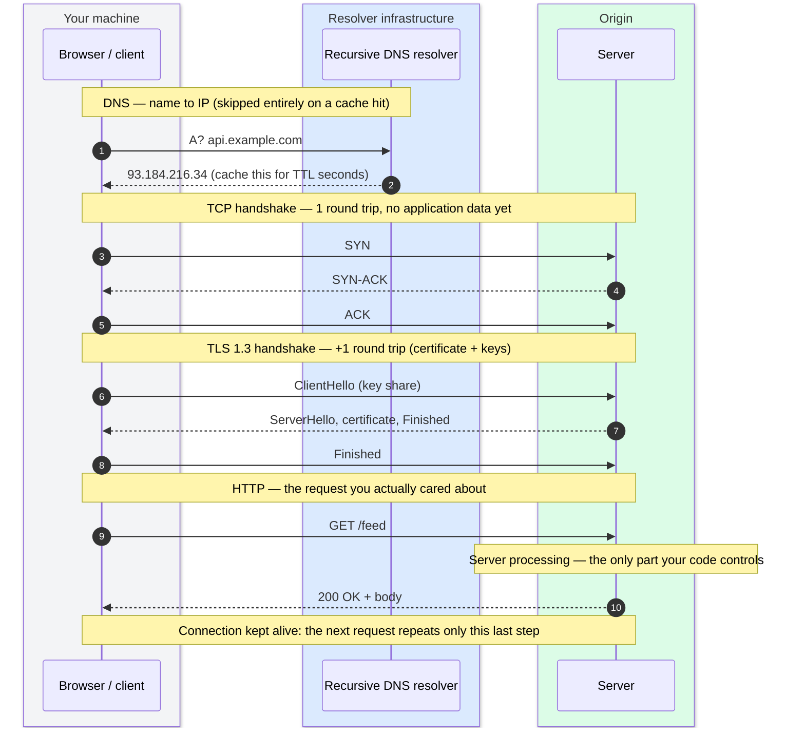
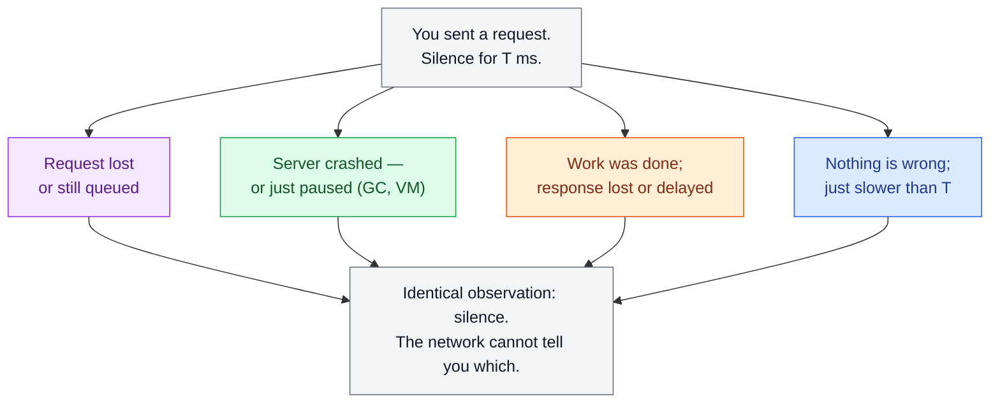

# Networking Essentials

> **Prerequisites:** [Thinking in Trade-offs](/synapse/system-design-from-first-principles/foundations/thinking-in-tradeoffs)
> **You'll be able to:** trace every round trip in an HTTPS request and name the cache that removes each one; choose between TCP, UDP, and QUIC and defend the default; reason about timeouts on a network that guarantees nothing.

---

## 🧨 The problem

### Latency you don't measure

Your service is fast.

The profiler says the handler runs in five milliseconds, the database query in two. Then a user in Mumbai hits your Virginia servers and waits most of a second before your code even starts to run. Nothing is broken.

The missing time went into places you probably never instrumented: DNS lookups, TCP and TLS handshakes, and multiple round trips across an ocean. Server processing is usually the only latency engineers measure and control — but on a cold request, it can be the smallest line item.

### Uncertainty you can't remove

A second, nastier version shows up in every distributed system:

- You send a payment request downstream and hear nothing for two seconds.
- Did it fail? Did it succeed and the response was lost? Is the provider just slow, dead, or paused by garbage collection?
- From your point of view, a lost request, a dead server, and a lost response are indistinguishable: you see the same thing — silence <abbr title="[p. 348]">[i]</abbr>.

Every system you design is machines talking over a network, so both problems — **latency you didn't count** and **uncertainty you can't remove** — are structural.

> This lesson covers the slice of networking a designer actually uses, and ends with the truth that shapes all distributed thinking: the network guarantees you *nothing*.

---

## 🧅 Intuition: layering

### The layering idea

Networking works because of one idea: **layering**.

When your code fetches a URL, you do not think about voltages on a wire or radio frames in the air, just as you call `open()` on a file without telling the disk head where to move. Each layer:

- offers a small promise to the layer above, and
- hides everything below.

Textbooks describe seven OSI layers. In practice, people use about four, and talk in OSI numbers mainly for three of them: **L3, L4, L7**.

| Layer          | What it moves                     | Promise it makes                                                | You'll meet            |
|----------------|-----------------------------------|-----------------------------------------------------------------|------------------------|
| Link           | Frames on one local segment       | "I'll get this to a machine on this network — probably."        | Ethernet, Wi‑Fi        |
| Network (L3)   | Packets between networks          | "I'll route this toward that IP address — best effort, no guarantees." | IP                     |
| Transport (L4) | End-to-end streams / datagrams    | "I'll add reliability and ordering — or keep it simple, your choice." | TCP, UDP, QUIC         |
| Application (L7) | Requests, messages, names       | "I'll give these bytes meaning."                                | HTTP, DNS, TLS*, gRPC  |

\* **TLS is the awkward guest.** It sits on top of TCP and underneath HTTP, securing the pipe rather than defining application messages. Treat it as a **security layer between L4 and L7**.

For a more textbook-style overview of the OSI model, see
[What is the OSI model? (AWS)](https://aws.amazon.com/what-is/osi-model/).

To see encapsulation happen — headers wrapping the payload layer by layer on the way down, and unwrapping on the way up — step through it yourself:

```simulator name=osi-encapsulation height=560 title="OSI Encapsulation Simulator"
```

### Two core intuitions

- **Asynchronous packet networks.** Everything above IP inherits IP’s behavior: the internet and datacenter networks are **asynchronous packet networks**. You can send a packet, but there is no guarantee of *when* it will arrive — or *whether* it will arrive at all <abbr title="[p. 347]">[i]</abbr>. Packets are dropped, delayed, duplicated, and reordered. Any stronger guarantee (for example TCP’s ordering) is **software compensating**, not the network becoming more reliable.

- **Kernel vs user space.** Transport and below run in the OS **kernel** — fast and efficient, but hard to change. Application protocols live in **user space** — flexible and fast‑evolving. Most interesting design choices for system designers therefore cluster at **L4 and L7**.

---

## ⚙️ Architecture: how the main pieces work

### 🤝 TCP: what “reliable” really means

TCP turns IP’s unreliable packets into a **byte stream**: a stateful, ordered, byte‑oriented connection between two endpoints.

Before any application data moves, client and server perform the **three‑way handshake**:

1. SYN
2. SYN‑ACK
3. ACK

That costs one full round trip purely in setup.

After the handshake, TCP does four jobs <abbr title="[pp. 348–349]">[i]</abbr>:

- **Retransmission.** The receiver sends acknowledgments (ACKs). Missing ACKs trigger resends.
- **Ordering.** Sequence numbers let the receiver reassemble packets in the order they were sent, even if the network reorders them.
- **Integrity.** Checksums detect corruption in transit.
- **Backpressure.** Flow control stops a fast sender from overwhelming a slow receiver, and congestion control prevents everyone from overwhelming the network. When you write to a socket, the OS buffers your data and decides when it can actually leave the machine <abbr title="[p. 349]">[i]</abbr>.

Those jobs earn TCP the word *“reliable”*, but that word oversells it. TCP **cannot** promise <abbr title="[p. 349]">[i]</abbr>:

1. **ACK ≠ “processed”.** An ACK means the remote *kernel* buffered your bytes, not that the application read and acted on them. The application can crash with your message still sitting in its socket buffer.
2. **No cross‑connection deduplication.** TCP suppresses duplicates only within one connection. If a connection drops, your client reconnects and resends, the remote application can see the message twice.
3. **No progress information on failure.** When a connection dies, you do not know how much of the sent data was processed: none, some, or all.
4. **No timing guarantee.** Retransmission time is unbounded. TCP cannot make a congested network fast; it only hides loss as extra delay <abbr title="[pp. 349, 354]">[i]</abbr>.

These limits are the technical backbone of **idempotency keys, retries, and timeout design** in later modules.

One practical wrinkle the textbook model does not show you: small writes can be delayed by TCP itself. Nagle’s algorithm coalesces tiny packets to improve efficiency, while `TCP_NODELAY` turns that behavior off when interactive latency matters.

---

### 🎙️ UDP: when late data is worthless

UDP makes the opposite trade.

- No handshake.
- No retransmission.
- No ordering.
- No backpressure.
- A fixed **8‑byte header** versus TCP’s 20–60 bytes.
- Datagrams are simply thrown at an IP address and port.

Why choose that? Because **retransmission only helps when late data is still valuable**.

- A packet with 20 ms of call audio that arrives 500 ms late is worse than useless: players fill the gap with silence, and the “retry” is a human saying “sorry, you cut out” <abbr title="[p. 354]">[i]</abbr>.
- Live video, game state, telemetry, and DNS lookups make the same trade: **lower latency variability** in exchange for **accepting loss** <abbr title="[p. 354]">[i]</abbr>.

For interviews and designs:

- The **default** is TCP — so much so that it often goes unmentioned.
- Reach for UDP only when you can clearly explain **why stale data is worthless** *and* how you handle **browser clients**, which expose UDP essentially only via WebRTC.

---

### ⚡ QUIC and HTTP/3

**QUIC** is a modern transport protocol built on top of UDP.

It:

- recreates TCP‑like **reliability per stream** on top of UDP,
- **bundles TLS into the transport**, so the transport and encryption handshakes are combined — often **1 round trip**, or **0** on resumption [web: RFC 9000],
- delivers each stream independently, so a loss affecting one stream stalls only that stream, not the entire connection.

**HTTP/3** is HTTP running over QUIC [web: RFC 9114].

DDIA’s analysis of TCP’s limits still applies <abbr title="[p. 348]">[i]</abbr>: QUIC is a better‑engineered way to offer roughly the same guarantees, not an escape from the unreliable network underneath.

For interviews, a good framing is:

> “QUIC is like a better TCP implemented over UDP, with built‑in TLS and per‑stream independence — but it’s newer and less ubiquitous.”

Mention QUIC when:

- handshake latency hurts (mobile, long‑distance links), or
- multiplexed streams over a single connection are central.

Then spend your detailed design time on other fundamentals.

---

### 🔒 TLS: securing the channel

**TLS** gives you:

- an **encrypted** and **integrity‑protected** channel, and
- proof (via certificates) that you are talking to the server associated with the hostname.

The price is extra round trips before the first byte of application data:

- TLS 1.2: typically **2 round trips** on top of TCP.
- TLS 1.3: typically **1 round trip**.
- TLS 1.3 **session resumption** lets a returning client send data in the first flight — **“0‑RTT”** — with a sharp caveat: 0‑RTT data can be **replayed** by an attacker, so only requests you are willing to process twice are safe [web: RFC 8446].

Note the rhyme with TCP’s reconnect duplication problem: escaping a lost handshake is often paid for with **possible duplicates**.

Scope honesty:

- TLS **encrypts the pipe**. It does **not** make the contents trustworthy.
- An HTTPS request is still attacker‑controlled input; you must validate it server‑side.

---

### 📇 DNS: names, addresses, and TTL

Before any TCP or TLS handshake, the client needs an IP address for `api.example.com`.

The typical path:

- Your machine asks a **recursive resolver** (e.g., your ISP’s resolver or a public one).
- On a cache miss, the resolver walks the hierarchy [web: RFC 1034]:
  - root servers → `.com` servers → `example.com`’s authoritative servers → final answer.
- Most DNS queries are carried over **UDP**.
- Every DNS answer includes a **TTL (time‑to‑live)**. Any resolver in the path may cache and serve that answer until the TTL expires.

This leads to two major design consequences:

- **Client‑side load balancing.** DNS can rotate between multiple IPs. Different clients land on different servers. This is the standard way to avoid a load balancer being a single point of failure (e.g., two load balancers in different regions, DNS rotating between them).

- **Change propagation is TTL‑bounded.** Your configuration changes propagate no faster than the TTL. A “DNS failover” with a 300‑second TTL means up to **five minutes** of clients faithfully trying the old, possibly dead, address. Low TTLs buy agility but reduce cache efficiency; that tension is the key DNS trade‑off.

---

### 🚧 HTTP/1.1 vs HTTP/2: head‑of‑line blocking

#### HTTP/1.1

In practice, HTTP/1.1 browsers allow **one outstanding request at a time per TCP connection**, even though the spec permits pipelining:

Browsers largely disabled pipelining because head-of-line blocking and buggy intermediaries made it unreliable in production [web: RFC 2616] [web: MDN — HTTP/1.x connection management].

- Response N must finish before request N+1 proceeds.
- One slow response blocks everything queued behind it: **head‑of‑line (HOL) blocking at the application layer**.
- Browsers work around this by opening several parallel TCP connections per host — typically on the order of six — which multiplies handshake overhead [web: MDN — HTTP/1.x connection management]. Modern browser limits vary by vendor and version, so treat \“six\” as a planning number, not a protocol rule.

#### HTTP/2

HTTP/2 fixes HOL at the **application layer**:

- It multiplexes many concurrent **streams** over a single TCP connection.
- Frames from different requests are interleaved so one slow response does not block others [web: RFC 9113].

But look one layer down:

- All streams share one **TCP byte stream**.
- TCP must deliver that byte stream **in order**, as a whole.
- One lost TCP packet stalls **all HTTP/2 streams** until the retransmission arrives.

HTTP/2 moved HOL blocking from **L7 to L4** [web: RFC 9114].

This residue is exactly what QUIC removes with per‑stream independence over UDP — which is why **HTTP/3** exists.

> General lesson: fixing a bottleneck at one layer often reveals the same bottleneck one layer down.

---

### ♻️ Connection reuse: compounding handshake costs

#### Cold HTTPS path

On a cold HTTPS request, count the ceremony before the first application byte:

- DNS lookup (unless cached),
- **TCP handshake** — 1 round trip,
- **TLS 1.3 handshake** — 1 round trip.

On an 80 ms cross‑Atlantic link, that is roughly **240 ms of overhead** before the request itself even departs — versus a handler that runs in 5 ms.

Multiply this:

- A service that opens a fresh connection for every request pays that cost on **every call**.
- A microservice chain that opens fresh connections at each hop pays it **at every hop**.

#### The standard remedy

The universal remedy is **connection reuse**:

- **HTTP keep‑alive** keeps the TCP connection open for subsequent requests.
- **HTTP/2** goes further and shares one connection among many concurrent streams.
- Clients and services maintain **connection pools**:
  - a set of pre‑warmed connections,
  - handed out per request and returned after.

In steady‑state, handshake costs become almost negligible.

The catch: a persistent connection is **shared state** at both ends. At scale, you must:

- size pools,
- reap idle connections,
- detect dead ones, and
- manage millions of long‑lived connections (for example WebSockets) where connection state dominates the design.

---

## 🧭 Data flow: fetching a URL end‑to‑end

Consider a cold client fetching:

> `https://api.example.com/feed`



Read this as a **ledger of round trips and caches**:

- **DNS:** one or more round trips, removed by resolver/OS/browser caches until TTL expiry.
- **TCP handshake:** 1 round trip, removed by keep‑alive and pooling.
- **TLS handshake:** 1 round trip (2 for TLS 1.2), removed by session resumption — or combined with transport handshake by QUIC.
- **HTTP request/response:** 1 round trip plus server processing — irreducible, unless you move the server closer (CDN/edge) or cache the response.
- **Connection teardown** (FIN/ACK) happens eventually, but clients do not wait for it.

---

## 🕳️ Failure modes: what the network actually guarantees

### Indistinguishable outcomes

When you send a request and receive no response for some time T, the following are all possible <abbr title="[pp. 347–348]">[i]</abbr>:

- The request was dropped.
- The request is still queued in the network or on the server.
- The server crashed.
- The server is paused (GC, VM suspension) and will resume later.
- The server completed the work but the **response was dropped or delayed**.
- Nothing is wrong; the system is simply slower than T.

From your point of view, all of these produce the same observation:



The network fundamentally provides no direct way to distinguish these cases.

### Timeouts as a design choice

The usual response is a **timeout**: after waiting T, you give up and assume failure — even though the work may still finish after you give up <abbr title="[p. 348]">[i]</abbr>.

You might wish for a formula:

- If the network guaranteed a maximum delay **d** and servers guaranteed a maximum processing time **r**, you could pick a safe timeout of **2d + r**.
- Real packet networks guarantee **neither** <abbr title="[pp. 352–353]">[i]</abbr>.

Delays are dominated by **queueing**:

- switch buffers when links are congested,
- OS queues when all cores are busy,
- hypervisor pauses in virtualized environments,
- TCP’s own sender‑side buffering <abbr title="[pp. 353–354]">[i]</abbr>.

Queues grow without bound as utilization approaches capacity. That is a deliberate design trade‑off: circuit‑switched telephone networks reserved end‑to‑end bandwidth and provided bounded delay at the cost of idle capacity; packet‑switched networks were chosen because bursty data traffic gets far better utilization from sharing. **Variable delay is a cost/benefit decision, not a law of nature** <abbr title="[pp. 355–357]">[i]</abbr>.

Timeouts are therefore a **trade‑off**, not a constant to memorize:

- Too **short**: you declare slow‑but‑alive nodes dead, retry work that may have succeeded, and push load onto already‑loaded nodes — risking cascades.
- Too **long**: users wait on truly dead nodes <abbr title="[p. 352]">[i]</abbr>.

Mature systems:

- choose timeouts **experimentally** from observed latency distributions, or
- **adapt them continuously** (e.g., Phi Accrual failure detector in Cassandra and Akka, TCP’s own retransmission timers) <abbr title="[p. 355]">[i]</abbr>.

Because timed‑out requests may still execute, retries in production are:

- paired with **exponential backoff + jitter**, and
- guarded by **idempotency keys** for mutating operations, so duplicates are harmless.

Sit with the underlying conclusion:

> “The fact that such partial failures can occur is the defining characteristic of distributed systems.” <abbr title="[p. 388]">[i]</abbr>

Networks drop, delay, duplicate, and reorder. Any design that assumes otherwise will fail in the tail.

---

## ⚖️ Key trade‑offs

### Transport choice

| Option   | Gives you                                                     | Costs you                                                 | Use when                                  |
|---------|----------------------------------------------------------------|------------------------------------------------------------|-------------------------------------------|
| TCP     | Ordering, retransmission, backpressure; universal support      | Handshake RTT; loss surfaces as delay; HOL at transport   | **Default** for almost everything <abbr title="[p. 349]">[i]</abbr> |
| UDP     | Minimal latency variance, no connection state, tiny header     | No delivery/ordering guarantees; you build reliability; weak browser support | Late data is worthless (voice/video, gaming, telemetry, DNS) <abbr title="[p. 354]">[i]</abbr> |
| QUIC    | TCP‑like reliability per stream, 1‑RTT combined transport+TLS handshake, no cross‑stream HOL | Newer, less ubiquitous tooling; still runs over unreliable network | Handshake latency or multiplexed streams dominate; mobile/lossy links [web: RFC 9000] |

### Connection strategy

| Option                        | Gives you                                              | Costs you                                        | Use when                                  |
|-------------------------------|--------------------------------------------------------|--------------------------------------------------|-------------------------------------------|
| New connection per request    | No connection state; extremely simple clients         | Full DNS + TCP + TLS handshake on every call    | Rare one‑off calls, simple scripts        |
| Keep‑alive + pooling          | Handshakes amortized; stable latency                  | Pool sizing, state at both ends, stale detection | **Default** for services and HTTP clients |
| Long‑lived persistent (e.g., WebSocket) | Server push, lowest per‑message overhead         | Connection state dominates at scale; L4‑aware load balancing; reconnect storms | High‑frequency bidirectional traffic      |

---

## 🔢 Numbers that matter

### Physics and round trips

- Light in fiber travels at roughly two‑thirds the speed of light: about **200,000 km/s**.
- New York ↔ London (~5,600 km) has a theoretical minimum round trip of ~**56 ms**; in practice, budget ≥80 ms.
- Local datacenter round trips can be <1 ms. No software optimization beats physics; only **moving endpoints closer** does.

Handshake ledger before the first application byte:

- TCP: 1 RTT.
- TLS 1.2: +2 RTTs.
- TLS 1.3: +1 RTT.
- TLS 1.3 resumption: 0–1 RTT.
- QUIC: 1 combined RTT, 0 on resumption [web: RFC 8446, RFC 9000].

Example on an 80 ms RTT path:

- Fresh HTTPS: ≈ 240 ms of setup + request/response round trips before the body arrives.
- Reused connection: ≈ 80 ms (only HTTP round trip) — a ~3× improvement your profiler on server code will not show.

Headers for intuition:

- UDP header: 8 bytes.
- TCP header: 20–60 bytes.

### How often the network fails

Empirical numbers <abbr title="[p. 350]">[i]</abbr>:

- One study of a medium‑sized datacenter observed ~**12 network faults per month**, roughly half disconnecting a single machine and half a whole rack.
- Delay tails can be extreme:
  - cross‑region RTTs reaching **minutes** at high percentiles,
  - intra‑datacenter packet delays exceeding **a minute** during topology changes.

Timeouts and capacity planning therefore care about **tail latency**, not just medians. Percentile analysis lives in [Latency, Throughput & Percentiles](/synapse/system-design-from-first-principles/foundations/latency-throughput-percentiles) and estimation habits in [Estimation & the Numbers](/synapse/system-design-from-first-principles/foundations/estimation-and-numbers).

---

## 🏭 In production

### Connection pooling

Connection pooling is ambient in real systems:

- Every serious HTTP client, database driver, and RPC framework uses pools.
- Many incidents are **pool incidents**:
  - pool exhaustion under spikes,
  - stale connections to rebooted backends,
  - thundering herd of re‑handshakes when a load balancer restarts and drops millions of keep‑alive connections.

Rule of thumb: treat “pool exhausted” and “connection reset by peer” as **capacity signals**, not mysteries about correctness.

### TLS termination at the edge

TLS is usually terminated at an **edge**:

- An L7 load balancer or CDN edge accepts clients’ TCP + TLS handshakes.
- It then forwards requests to backends over **separate, long‑lived internal connections**.

Benefits:

- Handshake round trips happen on the short client↔edge path.
- Origin hops are amortized across many requests.

A large share of the benefit of a CDN for dynamic traffic is this **edge termination and connection reuse**, even when responses are not cached.

### QUIC / HTTP/3 deployment

QUIC and HTTP/3 are real but unevenly deployed:

- Major browsers and CDNs support them.
- External web traffic now commonly uses HTTP/3 where clients and edges support it.
- A lot of intra‑datacenter traffic still runs over TCP / HTTP/1.1 / HTTP/2.

For interviews:

- Knowing QUIC earns credit with performance‑minded interviewers.
- Making it the core of a design is rarely necessary.

### Timeout tuning and retries

Timeout tuning in production follows DDIA’s advice <abbr title="[p. 355]">[i]</abbr>:

- measure round‑trip distributions across nodes and time,
- set timeouts empirically, or adapt them continuously (Phi Accrual, TCP retransmission logic).

In multitenant clouds, a noisy neighbor saturating shared NICs, links, or CPUs can distort your latencies with no direct visibility <abbr title="[pp. 354–355]">[i]</abbr>, making **static timeout constants age badly**.

Because a timed‑out request may have actually executed:

- retries use **exponential backoff + jitter**, and
- mutating APIs use **idempotency keys** so duplicate arrivals are safe.

DNS in production is both your **cheapest availability lever** and your **slowest**:

- rotating records across two load balancers in different regions is standard practice to avoid an LB as a single point of failure,
- but failover speed is capped by the **TTL** clients have cached.

---

## 🪤 Pitfalls & interview traps

> ⚠️ **Trap 1: “TCP is reliable, so my request went through.”**
> An ACK means the remote kernel buffered your bytes, not that the application processed them. The app can crash with your request still unread <abbr title="[p. 349]">[i]</abbr>.

> ⚠️ **Trap 2: “The timeout fired, so it failed.”**
> A timeout only means *you stopped waiting*, not that the work never completed <abbr title="[p. 348]">[i]</abbr>.

Together they imply two design rules used throughout this book:

- **Confirmation** requires an application‑level response.
- Any **retry of a mutation** must be idempotent.

Other common traps:

- **Retrying without idempotency.** After a timeout, a reconnect‑and‑resend can double‑charge a card because TCP deduplication is per connection <abbr title="[p. 349]">[i]</abbr>. Expect: “Your payment call timed out — what do you do next?”
- **“HTTP/2 solved head‑of‑line blocking.”** It solved HOL at the application layer, but HOL remains at the TCP layer. Saying “moved, not solved — QUIC is the real fix” is the senior answer [web: RFC 9114].
- **Ignoring handshake tax in microservice chains.** Five hops × fresh TLS connections per call quietly add up. Interviewers want to hear “keep‑alive and connection pools” when latency budgets are discussed.
- **Treating DNS changes as instant failover.** Clients keep using cached IPs until TTL expiry. Always mention TTL when you propose DNS‑based failover.
- **Choosing UDP for generic ‘performance’** where loss is not acceptable, or in browser‑heavy environments without a clear WebRTC usage story.
- **Trusting HTTPS request bodies.** Encryption in transit says nothing about the honesty of the sender; always validate server‑side.

---

## ✅ Check yourself

```quiz
{"prompt": "A client in New York makes its first HTTPS request to a server in London (~80 ms round trip, TLS 1.3, DNS already cached). Server processing takes 5 ms. Roughly when does the response arrive?", "options": ["~85 ms — one round trip plus processing", "~165 ms — TCP handshake, then request/response", "~245 ms — TCP handshake, TLS handshake, then request/response", "~325 ms — DNS, TCP, TLS, then request/response"], "answer": "~245 ms — TCP handshake, TLS handshake, then request/response"}
```

```quiz
{"prompt": "Ten HTTP/2 streams share one TCP connection. A packet belonging to stream 3 is lost in transit. What do the other nine streams experience?", "options": ["Nothing — HTTP/2 streams are independent", "They stall until TCP retransmits the lost packet", "They are reset and must be retried by the client", "Only streams opened after stream 3 stall"], "answer": "They stall until TCP retransmits the lost packet"}
```

```quiz
{"prompt": "You are designing the media path for a video call. A packet carrying 20 ms of audio is lost. Which behavior do you want from the transport?", "options": ["Retransmit it in order — TCP, so no audio is ever lost", "Skip it and keep playing — UDP, because late audio is worthless", "Retransmit it on a second parallel TCP connection", "Buffer a full second everywhere — TCP with a larger window"], "answer": "Skip it and keep playing — UDP, because late audio is worthless"}
```

```quiz
{"prompt": "Your service sent a charge request to a payment provider. The OS confirms the bytes were ACKed — then the connection dies before any HTTP response arrives. What do you actually know?", "options": ["The charge succeeded — TCP is reliable and the data was delivered", "The charge failed — no response means the request never arrived", "The provider's kernel received the bytes; whether the application processed the charge is unknown", "TCP will automatically resubmit the charge on the next connection"], "answer": "The provider's kernel received the bytes; whether the application processed the charge is unknown"}
```

<details>
<summary><strong>Q:</strong> Walk through fetching <code>https://api.example.com/feed</code> from a completely cold client. Name every round trip before the first byte of the response body — and the mechanism that would remove each one on a warm request.</summary>

**A:**
1. **DNS resolution** — one or more round trips via the recursive resolver (which may itself walk root → TLD → authoritative). Removed by DNS caching until TTL expiry.
2. **TCP three‑way handshake** — one round trip. Removed by keep‑alive and connection pooling.
3. **TLS 1.3 handshake** — one round trip (two under TLS 1.2). Removed by TLS session resumption, or merged into the transport handshake by QUIC.
4. **HTTP request/response** — one round trip plus server processing. Irreducible except by moving the server closer (CDN/edge) or caching the response.

On an 80 ms path, that’s roughly 320 ms cold (including DNS) vs ~80 ms warm (no DNS, handshake already paid).

</details>

<details>
<summary><strong>Q:</strong> Why is there no single “correct” timeout value for a service call, and what do mature systems do instead?</summary>

**A:**
A provably safe timeout of 2d + r exists only if the network has a bounded maximum delay d and servers have a bounded maximum handling time r. Packet‑switched networks bound neither: delay is dominated by queueing (switch buffers, busy CPUs, VM pauses, TCP buffering) which grows without bound near capacity, and cross‑region delays can reach minutes <abbr title="[pp. 350, 352–354]">[i]</abbr>. Short timeouts declare slow‑but‑alive nodes dead and cause duplicate work or cascades; long ones make users wait on dead nodes <abbr title="[p. 352]">[i]</abbr>. Mature systems measure latency distributions and set timeouts empirically or adapt them (Phi Accrual in Cassandra/Akka) <abbr title="[p. 355]">[i]</abbr>, pair retries with exponential backoff + jitter, and make mutating operations idempotent because a timed‑out attempt may still have completed.

</details>

<details>
<summary><strong>Q:</strong> Your p50 latency is 30 ms, but p99 spikes to 2 s at random times unrelated to your deploys. What network-level causes should you consider?</summary>

**A:**
Likely causes are **queueing and contention**: upstream switch/link congestion, destination host OS queues when CPUs are busy, hypervisor pauses, and TCP retransmissions turning packet loss into latency <abbr title="[pp. 353–354]">[i]</abbr>. In a multitenant cloud, a “noisy neighbor” saturating shared links, NICs, or CPUs produces exactly this pattern, and you often have no direct visibility into their usage <abbr title="[pp. 354–355]">[i]</abbr>. Tail latency, not median, must drive timeout and capacity decisions.

</details>

---

## 🔬 Proofs of concept & deeper reading

To go deeper on the protocols summarized here:

- [High Performance Browser Networking](https://hpbn.co/) — TCP, TLS, HTTP/1.1 → HTTP/2 → HTTP/3, and why each round trip costs what it does.
- [Beej's Guide to Network Programming](https://beej.us/guide/bgnet/) — sockets from first principles (`connect()`, `send()`, `recv()`).
- [The Illustrated TLS 1.3 Connection](https://tls13.xargs.org/) — a real TLS 1.3 handshake, byte‑by‑byte.

---

## 📚 Sources

- DDIA2 ch. 9 pp. 347–349 (asynchronous packet networks; six failure modes of a request; TCP’s guarantees and limits).
- DDIA2 ch. 9 pp. 350–353 (network faults in practice; multi‑minute delay tails; timeouts and their trade‑offs).
- DDIA2 ch. 9 pp. 353–355 (queueing as the source of delay variability; TCP vs UDP for latency‑sensitive traffic; noisy neighbors; adaptive timeouts).
- DDIA2 ch. 9 pp. 355–357 (circuit vs packet switching; variable delay as a trade‑off).
- DDIA2 ch. 9 p. 388 (partial failure as defining characteristic of distributed systems).
- [web: RFC 8446] TLS 1.3 — handshake, resumption, 0‑RTT replay caveats.
- [web: RFC 9000] QUIC — UDP‑based, combined transport+TLS, independent streams.
- [web: RFC 9113] HTTP/2 — stream multiplexing over one TCP connection.
- [web: RFC 9114] HTTP/3 — HTTP over QUIC; TCP HOL as HTTP/2’s residual limit.
- [web: RFC 1034] DNS — name hierarchy, recursion, TTL‑based caching.
- [web: MDN — HTTP/1.x connection management] — HTTP/1.1 connections and browser limits.