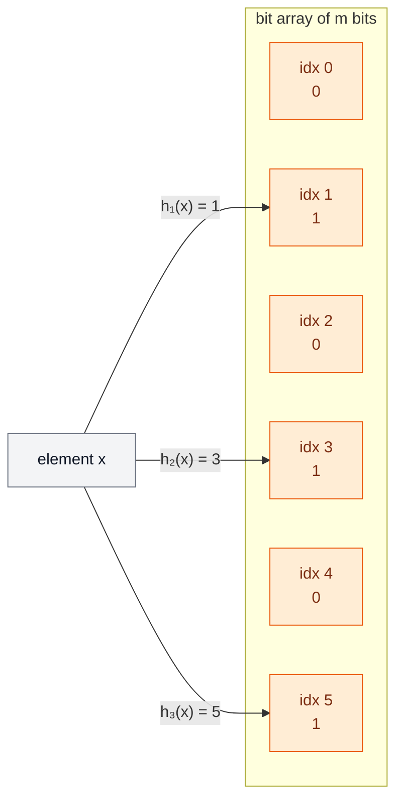
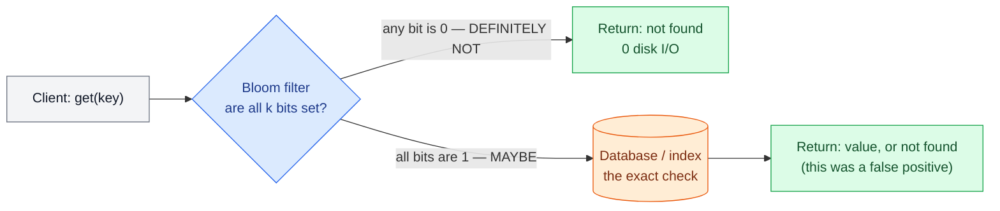
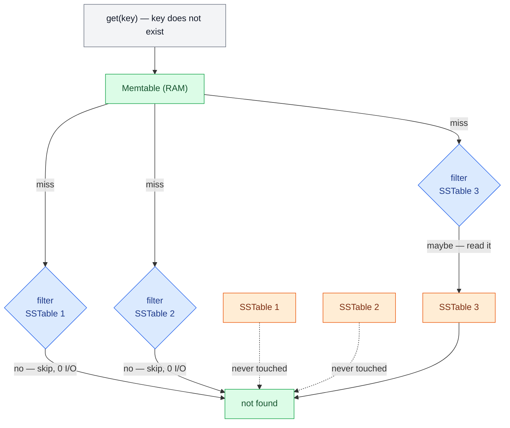
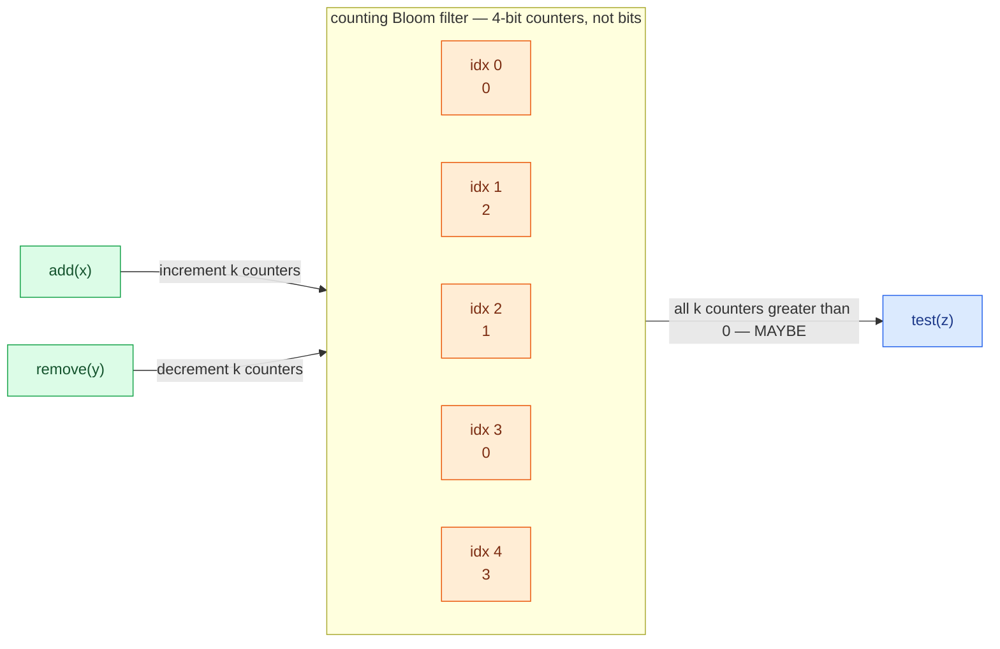
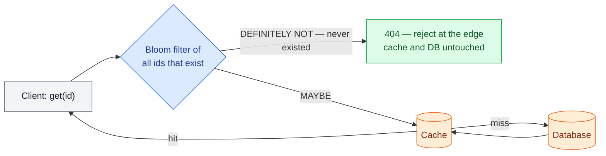

# 🧽 Bloom Filters — Deep Reference

> **Prerequisites:** [Probabilistic Data Structures](/synapse/system-design-from-first-principles/building-blocks/probabilistic-data-structures), [Storage Engines](/synapse/system-design-from-first-principles/data-foundations/storage-engines) | **You'll be able to:** derive the false-positive formula rather than quote it, size `m` and `k` from a target error rate and expected volume, and say precisely which production systems put a Bloom filter in front of what, and why.

<div style="border-left:4px solid #15448e;background:rgba(21,68,142,0.08);padding:0.6rem 1rem;border-radius:0 0.5rem 0.5rem 0;margin:1.25rem 0">

📘 **This is the deep dive, not the introduction.** [Probabilistic Data Structures](/synapse/system-design-from-first-principles/building-blocks/probabilistic-data-structures) teaches the Bloom filter alongside its three siblings — HyperLogLog, Count-Min sketch, t-digest — and is where to start if the phrase *"one-sided error"* is new. This page assumes that and goes further: the derivation, the sizing arithmetic, working code with measured results, and the variants.

</div>

---

## 🧨 The problem (why this exists)

A Bloom filter answers exactly one question — *"have I seen this before?"* — and answers it in one of two ways:

- **definitely not**, which is always true, or
- **maybe**, which is usually true and occasionally wrong.

That asymmetry is the entire product. It buys you a membership test that fits in memory when the exact set does not, at the cost of a small, *tunable*, one-sided error. Use it as a **front gate** before something expensive — a disk read, a network call, a database query:

- if it says **definitely not**, skip the expensive work entirely;
- if it says **maybe**, do the full exact check.

The saving is real only when misses are common. A filter in front of a lookup that almost always hits is pure overhead.

---

## 💡 Intuition first

Imagine a key–value store holding billions of IDs, where you often need to ask *"is this key here?"* Storing every ID in a hash set is exact but enormous — ten billion 80-byte keys is **800 GB**, which no longer fits in memory on one machine, and fitting in memory was the whole point.

The Bloom filter throws away the keys and keeps only a **fingerprint of the fact that you saw them**: a fixed-size array of bits, plus a handful of hash functions that decide which bits each key lights up. To test a key, hash it the same way and look at those bits. If any is 0, the key was never added — adding it would have set that bit. If all are 1, *probably* it was added; or possibly other keys happened to light up exactly those bits between them.

Three properties follow, and they're the ones worth memorising:

- **Space-efficient** — a fixed bit array, sized from your error target, independent of how big the items themselves are.
- **Fast** — a few hash computations and bit tests per query, no pointer chasing.
- **One-sided error** — false positives are possible, false negatives are impossible. The classic form also supports no deletions.

---

## ⚙️ How it works

### Structure

A classic Bloom filter is:

- a bit array of length `m`, all zero to start, and
- `k` independent hash functions `h₁ … h_k`, each mapping an element to an index in `0 … m-1`.

**To insert `x`:** compute `h₁(x) … h_k(x)` and set each of those bits to 1.

**To test `x`:** compute the same `k` positions. If **any** bit is 0 → **definitely not present**. If **all** are 1 → **maybe present**.



False positives happen because distinct elements can set overlapping bits. False *negatives* cannot happen: bits are only ever set, never cleared, so every bit an inserted element lit up is still lit.

### As a front gate



Note where the exactness lives: the filter never answers a query on its own when it says *maybe*. It only ever removes work.

---

## 🧮 The false-positive math, derived

Four quantities, and the whole subject is the relationship between them:

| symbol | meaning |
| --- | --- |
| `m` | number of bits in the array |
| `n` | number of elements inserted |
| `k` | number of hash functions |
| `p` | probability a **non-member** is reported as *maybe present* |

### Step 1 — the chance a given bit is still 0

Each insertion sets `k` bits, so after `n` insertions there have been `k·n` bit-setting operations. Assuming hashes distribute uniformly, one operation leaves a particular bit alone with probability `1 - 1/m`, so after all of them:

```text
P(bit is 0) = (1 - 1/m)^(k·n)
P(bit is 1) = 1 - (1 - 1/m)^(k·n)
```

For large `m`, use `(1 - 1/m)^m ≈ e⁻¹` to get the form everyone actually quotes:

```text
P(bit is 0) ≈ e^(-k·n/m)
P(bit is 1) ≈ 1 - e^(-k·n/m)
```

### Step 2 — the false-positive probability

A query for a non-member checks `k` positions. It's a false positive when all `k` happen to be 1:

```text
p = (1 - (1 - 1/m)^(k·n))^k  ≈  (1 - e^(-k·n/m))^k
```

<div style="border-left:4px solid #da5233;background:rgba(218,82,51,0.08);padding:0.6rem 1rem;border-radius:0 0.5rem 0.5rem 0;margin:1.25rem 0">

⚠️ **This formula is a very good approximation, not an identity.** It treats the `k` bit positions as independent, which they aren't quite. The exact combinatorial expression is meaningfully harder and differs negligibly at practical sizes — see Bose et al. for the correct treatment and for why the naive formula is nonetheless safe to design with [web: Bose et al., *"On the false-positive rate of Bloom filters"*, Information Processing Letters, 2008].

</div>

### Step 3 — the optimal number of hashes

More hash functions set more bits per insert (filling the array faster) but demand more simultaneous hits for a false positive. Those pull in opposite directions, and the minimum sits at:

```text
k_opt = (m/n) · ln 2 ≈ 0.693 · (m/n)
```

Substituting that back gives the memorable bound `p_min ≈ 0.6185^(m/n)` — false-positive rate falls **exponentially** in bits per element.

### Step 4 — sizing from a target

In practice you know `n` and the `p` you can tolerate, and you solve for the rest:

```text
m = -(n · ln p) / (ln 2)²
k = (m/n) · ln 2
```

Two consequences worth internalising:

- **`p` depends only on the ratio `m/n`**, never on absolute size. A filter for a thousand items and one for a billion have the same error rate at the same bits per element. (This is why the demo below can use 200,000 items and still speak about a million.)
- **~10 bits per element buys ~1%**, and each additional ~5 bits per element divides the error by roughly 10. Ten *bits* — not bytes — per item, regardless of how large the items are.

| target `p` | bits per element (`m/n`) | `k` | 1M elements needs |
| --- | --- | --- | --- |
| 10% | 4.79 | 3 | ~0.6 MB |
| 1% | 9.59 | 7 | ~1.2 MB |
| 0.1% | 14.38 | 10 | ~1.8 MB |
| 0.01% | 19.17 | 13 | ~2.4 MB |

---

## 🔢 Numbers that matter — a worked sizing

Design a filter for one database shard: up to `n = 1,000,000` keys, target `p = 1%`.

```text
ln(0.01)  = -4.6052
(ln 2)²   =  0.4809

m = -(1,000,000 × -4.6052) / 0.4809 = 9,585,058 bits ≈ 1.2 MB
k = (9,585,058 / 1,000,000) × 0.6931 = 6.64 → 7
```

<div style="border-left:4px solid #da5233;background:rgba(218,82,51,0.08);padding:0.6rem 1rem;border-radius:0 0.5rem 0.5rem 0;margin:1.25rem 0">

⚠️ **Round `k`, don't truncate it.** `int(6.64)` is 6, and a great many hand-rolled implementations silently ship a filter that isn't the one they designed. The error here is small — 6 hashes gives 1.014% against 7's 1.004% — but the habit is what bites you elsewhere, and truncation is never the intent.

</div>

**What it buys.** Say half your queries are for keys that don't exist, at 1,000,000 misses per minute. Without the filter, that's 1,000,000 index or disk probes. With it, ~99% are rejected in memory and only the ~1% false positives — about **10,000 probes** — reach storage. The filter itself costs 1.2 MB and seven hash computations per query.

### Per-SSTable filters in an LSM tree

This is the canonical deployment, and the reason every LSM-tree engine ships one. A read for a key that doesn't exist would otherwise have to check *every* SSTable before concluding *"not found"* — the most expensive possible answer. A filter per SSTable turns almost all of those into memory-only rejections.



SSTable 3's read is the false positive: the filter said *maybe*, the read said no. One wasted I/O instead of three.

---

## 🐍 Theory vs measurement

A complete implementation plus the experiment that checks the formula against reality. It runs in about a second.

```python
import hashlib
import math


class BloomFilter:
    """Teaching implementation. Production filters use MurmurHash or
    xxHash rather than SHA-256, which is far slower than necessary here
    (a Bloom filter needs uniformity, not cryptographic strength)."""

    def __init__(self, capacity: int, error_rate: float) -> None:
        self.capacity = capacity
        self.error_rate = error_rate
        # m = -n ln(p) / (ln 2)^2   and   k = (m/n) ln 2
        self.m = int(-capacity * math.log(error_rate) / (math.log(2) ** 2))
        # round(), not int(): int() truncates 6.64 to 6 and silently
        # ships a filter that is not the one you designed.
        self.k = max(1, round((self.m / capacity) * math.log(2)))
        # m BITS, packed 8-to-a-byte. The space claim is only true if you
        # actually store bits -- a list of 0/1 ints costs ~8 bytes each.
        self._bits = bytearray((self.m + 7) // 8)

    def _positions(self, item: str):
        # Double hashing: one SHA-256 yields two 64-bit base hashes, from
        # which we derive k positions as h1 + i*h2. Cheaper than k
        # independent hashes and, in practice, indistinguishable in
        # false-positive rate (Kirsch & Mitzenmacher, 2006).
        digest = hashlib.sha256(item.encode("utf-8")).digest()
        h1 = int.from_bytes(digest[:8], "big")
        h2 = int.from_bytes(digest[8:16], "big") | 1  # odd, so it is never 0
        for i in range(self.k):
            yield (h1 + i * h2) % self.m

    def add(self, item: str) -> None:
        for pos in self._positions(item):
            self._bits[pos >> 3] |= 1 << (pos & 7)

    def might_contain(self, item: str) -> bool:
        return all(
            (self._bits[pos >> 3] >> (pos & 7)) & 1
            for pos in self._positions(item)
        )

    def theoretical_fp_rate(self, n_inserted: int) -> float:
        return (1 - math.exp(-self.k * n_inserted / self.m)) ** self.k


if __name__ == "__main__":
    # p depends only on the ratio m/n, so 200k items at 1% behaves
    # exactly like 1M items at 1% -- and finishes in about a second.
    N_INSERT = 200_000
    N_PROBE = 50_000
    TARGET_P = 0.01

    bf = BloomFilter(capacity=N_INSERT, error_rate=TARGET_P)

    for i in range(N_INSERT):
        bf.add(f"key_{i}")

    # No false negatives, ever. This is a guarantee, not a measurement.
    missing = sum(1 for i in range(N_INSERT) if not bf.might_contain(f"key_{i}"))

    # Probe keys that were definitely never inserted.
    hits = sum(
        1 for i in range(N_INSERT, N_INSERT + N_PROBE)
        if bf.might_contain(f"key_{i}")
    )

    print(f"m (bits)            : {bf.m:,}  ({bf.m / 8 / 1024 / 1024:.2f} MiB)")
    print(f"k (hash functions)  : {bf.k}")
    print(f"bits per element    : {bf.m / N_INSERT:.2f}")
    print(f"false negatives     : {missing}   <- must be 0")
    print(f"empirical  p        : {hits / N_PROBE:.5f}")
    print(f"theoretical p       : {bf.theoretical_fp_rate(N_INSERT):.5f}")
```

Running it prints:

```text
m (bits)            : 1,917,011  (0.23 MiB)
k (hash functions)  : 7
bits per element    : 9.59
false negatives     : 0   <- must be 0
empirical  p        : 0.01030
theoretical p       : 0.01004
```

Measured **1.030%** against a predicted **1.004%** — agreement to within the sampling noise you'd expect from 50,000 probes, and zero false negatives, as guaranteed. The formula is not a rule of thumb; it is what the structure actually does.

---

## 🧬 Variants and practical hardening

### Deriving `k` hashes without `k` hash functions

True independence across `k` hash functions is unnecessary. Standard practice computes two base hashes and derives the rest as `h₁ + i·h₂ mod m` for `i = 0 … k-1` — **double hashing**, used in the code above. The false-positive rate is asymptotically unchanged [web: Kirsch & Mitzenmacher, *"Less Hashing, Same Performance"*, ESA 2006]. Pick a fast, well-distributed base hash (MurmurHash3, xxHash); cryptographic strength is irrelevant unless an adversary chooses your keys — and if one does, see the pitfall below.

### Counting Bloom filters — supporting deletion

Clearing bits on delete would corrupt other elements' membership and create false *negatives*, the one error the structure must never make. The fix is to replace each bit with a small counter (typically 4 bits): insert increments, delete decrements, and a query treats *"counter > 0"* as a set bit.



The cost is roughly **4× the space**, and 4-bit counters can overflow under heavy skew — saturating (rather than wrapping) is the safe behaviour, since it degrades toward false positives instead of false negatives.

### When you don't know `n` in advance

Sizing assumes you know `n` up front. Exceed it and `p` degrades — quietly, because nothing errors; you just start doing more expensive work than you budgeted for. Two answers:

- **Scalable Bloom filters** chain progressively larger filters with tightening error rates, so the aggregate error stays bounded as the set grows.
- **Cuckoo filters** support deletion natively and are usually more space-efficient below about 3% error [web: Fan, Andersen, Kaminsky, Mitzenmacher, *"Cuckoo Filter: Practically Better Than Bloom"*, CoNEXT 2014].

---

## 🏭 In production

**LSM-tree storage engines** — RocksDB, LevelDB, Cassandra, HBase. A filter per SSTable so a point read skips files that cannot contain the key. This is the highest-volume Bloom filter deployment in existence, and the reason a *"key not found"* is not proportionally more expensive than a hit.

**Caches and CDNs** — detecting *"one-hit wonders"*, objects requested exactly once, which are worth serving but not worth caching. A filter of previously-seen URLs answers *"has anyone asked for this before?"* cheaply enough to run on every request.

**Crawlers and pipelines** — the *"have I fetched this URL?"* check across billions of URLs, where the exact set does not fit in memory. This is the [web crawler](/synapse/system-design-from-first-principles/case-studies/web-crawler) dedup problem.

**Safe-browsing and credential checks** — a local filter of known-bad URLs or breached passwords rejects the overwhelmingly common *"this is fine"* case without a network round trip, escalating only on *maybe*.

**Redis** — `BF.RESERVE`, `BF.ADD` and `BF.EXISTS` take a capacity and an error rate, and size `m` and `k` with exactly the formulas above [web: redis.io — Bloom filter].



That last pattern is **cache-penetration defence**: requests for ids that never existed miss the cache by definition and hit the database every time, which is exactly what an attacker would send. A filter of valid ids turns that from a database load problem into a memory lookup.

---

## 🪤 Pitfalls & traps

**Using one where a false positive isn't cheap.** The design assumes *maybe* costs you an extra exact check. If *maybe* means "charge the customer" or "skip the security scan", the structure is wrong for the job — not mis-tuned, wrong.

**Forgetting the filter has to be built and kept.** It must be populated from the same data it guards, and rebuilt when that data is rebuilt. A filter that drifts out of sync with its backing store starts producing false *negatives*, which is the one failure the structure is supposed to make impossible. Filters are derived data: treat them as a cache to be regenerated, never as a source of truth.

**Sizing for today's `n`.** The error rate degrades silently as the set grows past the design point — no exception, no alert, just a slowly rising rate of expensive work. Monitor the fill ratio (fraction of bits set) and rebuild or scale before it passes ~50%.

**Assuming a filter is safe against adversarial input.** With a known, non-keyed hash, an attacker can craft keys that collide onto set bits and drive your false-positive rate toward 1, turning the filter into a load amplifier. If inputs are attacker-controlled, use a keyed hash (SipHash) with a secret seed.

**Sharing one filter across shards.** A filter answers for the set it was built from. One global filter over a partitioned dataset tells you an item exists *somewhere*, which is rarely the question — you wanted to know which shard. Build one per shard, per SSTable, per whatever unit you're trying to skip.

---

## ✅ Check yourself

```quiz
{"prompt": "A Bloom filter returns 'maybe present' for a key. What do you know?", "options": ["The key is present, with probability 1 - p", "Nothing definite — you must do the exact lookup to find out", "The key is present, since false negatives are impossible", "The filter is over capacity and needs rebuilding"], "answer": "Nothing definite — you must do the exact lookup to find out"}
```

```quiz
{"prompt": "You have a filter sized for 1M elements at 1% error, using ~9.6 bits per element. You now need 0.1% error for the same 1M elements. Roughly what happens to memory?", "options": ["It multiplies by 10, tracking the error rate", "It grows by about 50% — from ~9.6 to ~14.4 bits per element", "It doubles, since each 10x in accuracy costs one extra bit per element", "It is unchanged; you only increase k"], "answer": "It grows by about 50% — from ~9.6 to ~14.4 bits per element"}
```

```quiz
{"prompt": "Which of these is the WRONG job for a Bloom filter?", "options": ["Skipping SSTables that cannot contain a key", "Deciding whether a URL has already been crawled", "Confirming a username is free so you can create the account immediately", "Rejecting requests for object ids that have never existed"], "answer": "Confirming a username is free so you can create the account immediately"}
```

```quiz
{"prompt": "Your filter was sized for n = 1,000,000 but the dataset has quietly grown to 4,000,000 entries. What do you observe?", "options": ["Lookups start returning false negatives for some inserted keys", "The false-positive rate climbs sharply, so more queries fall through to the expensive exact check", "Inserts begin to fail once the array is full", "Nothing changes; the rate depends only on k"], "answer": "The false-positive rate climbs sharply, so more queries fall through to the expensive exact check"}
```

<details>
<summary><strong>Q:</strong> Why can a classic Bloom filter never support deletion by clearing the bits an element set?</summary>

Because bits are shared. Any of the `k` bits your element set may also have been set by a different element, and clearing it would make that other element's test fail — a **false negative**, which is the single error the structure guarantees cannot happen. The whole value proposition rests on *"definitely not"* being trustworthy; an implementation that can produce false negatives is not a Bloom filter with a bug, it's a different (and much less useful) data structure.

A counting Bloom filter solves this by storing small counters instead of bits, so a decrement only removes *your* contribution — at roughly 4× the space.

</details>

<details>
<summary><strong>Q:</strong> Adding more hash functions means more bits must match for a false positive. So why isn't a larger <code>k</code> always better?</summary>

Because every insert also sets `k` bits, so a larger `k` fills the array faster. The two effects pull in opposite directions: raising `k` makes each individual false positive less likely but makes the array denser, and past a point density wins and `p` starts rising again.

The minimum sits at `k = (m/n)·ln 2`, which is exactly the value that leaves the array about **half full** — the point of maximum entropy per bit. Both under- and over-shooting cost you; the curve is fairly flat near the optimum, which is why rounding to a whole number is harmless.

</details>

<details>
<summary><strong>Q:</strong> You put a Bloom filter in front of a database and measured no improvement. What's the most likely explanation?</summary>

Your queries mostly hit. The filter only ever *removes* work on the *negative* path — every *maybe* still pays the full lookup, plus the hash computations you just added. If 95% of queries are for keys that exist, you've added cost to 95% of your traffic to save on 5%.

Filters pay off in proportion to your miss rate. Measure that first: it decides whether the structure helps at all, well before any question of sizing `m` and `k`.

</details>

---

## 📚 Sources

- **DDIA2 ch. 4** pp. 122–123 (Bloom filters: mechanism, one-sided error, ~10 bits per item ≈ 1% false positives), p. 129 (Bloom filters cutting LSM-tree point-read I/O).
- [web: Bloom, B. H., *"Space/time trade-offs in hash coding with allowable errors"*, CACM 13(7), 1970] — the original paper.
- [web: Broder & Mitzenmacher, *"Network Applications of Bloom Filters: A Survey"*, Internet Mathematics, 2004] — the standard reference for the derivation and the optimal-`k` result.
- [web: Bose, Guo, Kranakis et al., *"On the false-positive rate of Bloom filters"*, Information Processing Letters, 2008] — why the familiar formula is an approximation, and the exact expression.
- [web: Kirsch & Mitzenmacher, *"Less Hashing, Same Performance: Building a Better Bloom Filter"*, ESA 2006] — double hashing in place of `k` independent hashes.
- [web: Fan, Andersen, Kaminsky, Mitzenmacher, *"Cuckoo Filter: Practically Better Than Bloom"*, CoNEXT 2014] — deletion support and better space below ~3% error.
- [web: redis.io — Bloom filter (`BF.RESERVE` capacity and error-rate sizing)].
- **Measured, not assumed.** The empirical figures in *Theory vs measurement* are the actual output of the program on this page, run twice for determinism.

Related lessons: [Probabilistic Data Structures](/synapse/system-design-from-first-principles/building-blocks/probabilistic-data-structures) · [Storage Engines](/synapse/system-design-from-first-principles/data-foundations/storage-engines) · [Caching](/synapse/system-design-from-first-principles/building-blocks/caching) · [Web Crawler](/synapse/system-design-from-first-principles/case-studies/web-crawler)
